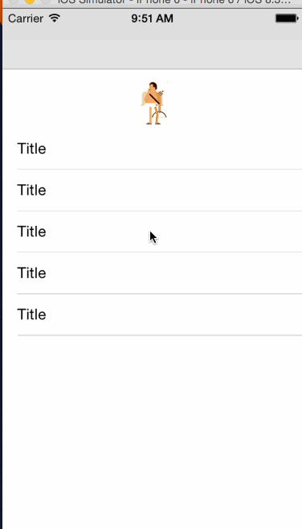

# HaidoraRefreshExtension

[HaidoraRefresh](https://github.com/Haidora/HaidoraRefresh)动画自定义

## Usage

* ###SimpleColor

	

* ###Gif

    

## Installation

HaidoraRefreshExtension is available through [HaidoraPods](https://github.com/Haidora/HaidoraPods). To install
it, simply add the following line to your Podfile:

```ruby
pod "HaidoraRefreshExtension"
```

## Author

mrdaios, mrdaios@gmail.com

## License

HaidoraRefreshExtension is available under the MIT license. See the LICENSE file for more info.
